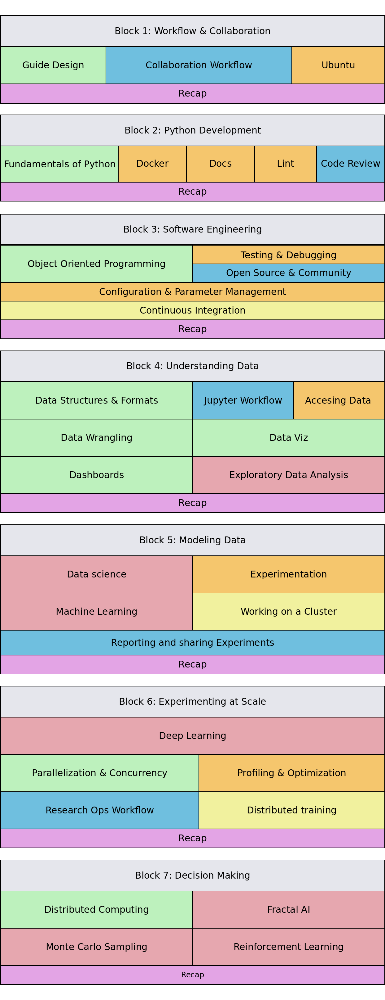

# Fragile Course

You can use the Company Guide to learn how to improve your productivity on your own projects. This
section organizes the contents of the Guide proposing a timeline to learn about the different topics.

The course is divided on 7 different blocks covering all the different areas of AI research.

:::{figure-md} git-flow
:width: 400px
:align: center

Course structure
:::