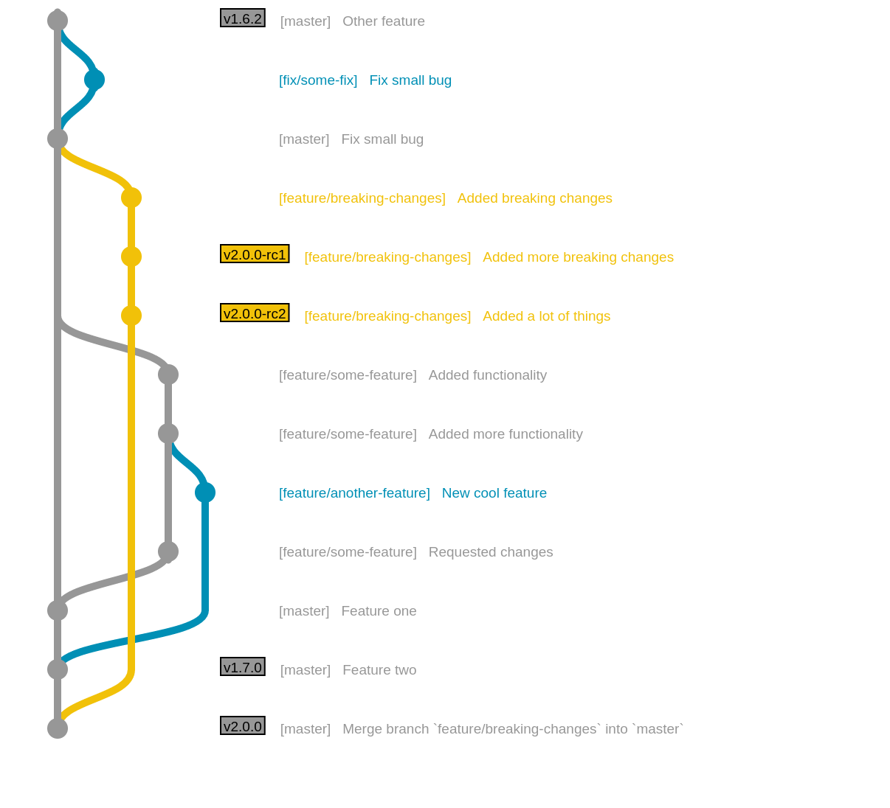

# Collaborating on a project

## 1. Create feature branch / hot fix branch
On your fork, create a new branch from the latest upstream master branch
commit of the repository you need to work on.

We do not enforce any particular branch naming policy, but we recommend using prefixes, 
like `fix`, `feature` or `docs`, for example.

## 2. Development and Pull Requests
Work on your local repository as you see fit. When the time comes to make the PR, rearrange your 
commits to improve its readability: squash similar changes into individual commits and try 
to keep the overall commit count at a minimum.

## 3. Code review and requested changes

- The project maintainer or a designated reviewer will review PRs.

After a code review, add the requested changes in a new commit. This is useful
because it’s possible to check again only the specific changes that the reviewer
requested. When your PR is approved, rearrange all the commits to have a descriptive 
history of your changes. Also, rebase your pull request with master branch.

### 3.1 Avoiding cascading delays when submitting PRs that depend on one another
If you want to submit several PRs that depend on one another, and you don’t want to wait for the revisions 
of the former to submit the latter, you can, as an exceptional measure, submit them without 
waiting to rebase them against master, so each of them will depend on the changes of the previous ones.

Always add a comment to the Pull Request showing that it depends on other PRs
that must be merged first.

To merge this kind of Pull Request you need to know how to use the
`rebase -i` git command:

- (Maintainers only) Merge into master the first PR in the dependency chain.
- Because this PR is merged using squash, you need to rewrite your PR commit
history removing old commits from the previous PR and adding the squashed one from
master. Using `rebase -i` command is a simple task.
