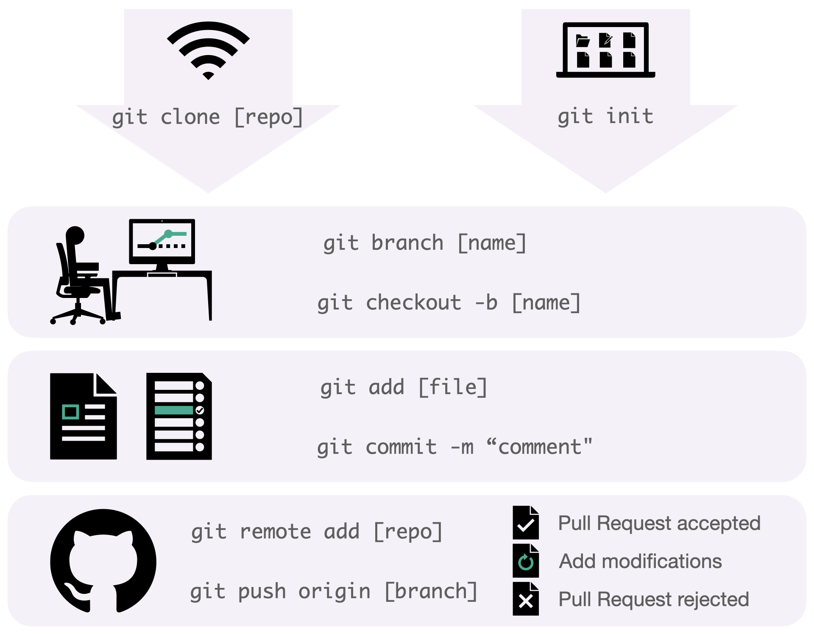

# Collaborating on a project

Git workflow is the basis that supports the entire development process, promoting the collaboration
among team members while avoiding redundant tasks in a distributed environment. It consists in a 
set of steps outlined in the following document: 

:::{figure-md} git-flow
:width: 400px
:align: center

Git workflow
:::

1. SETUP: Download an online repository using `git clone [url repo]` or start your own local Git repository using `git init`.
2. BRANCH: Create your safe environment using `git branch [branch-name]`. This isolates your local work and allows testing additional features. 
3. STAGE & COMMIT: Stage your recent work using `git add [modified-file]` and save it with `git commit -s -m "[comment]"`.
4. SHARE: Time to upload your project. Add a Git URL using an alias with `git remote add [alias] [url repo]` in case that your project had been started locally. Upload your local branch commits to the remote repository using `git push [alias] [local-branch]`.
5. REVIEW: Launch a new __Pull Request__ to publicize your modifications and start a reviewing process. This opens a discussion with your teammates concerning the correctness of your changes. If the proposal succeeds, your modifications will be merged into the main line. Reviewers can ask you to include extra adjustments to approve your code.

:::{admonition} Remember
:class: note
When committing, the tag `-s/--signoff` is necessary in our organization to pass the _DCO_ automatic check in the CI pipeline.
:::

## 1. Open an issue
We use issues to keep track of the evolution of our software projects. We should create an issue
describing the new functionality/fixes that we want to add to the code base. This ensures that 
every relevant contribution can be discussed and documented.

The Issues will document all the discussion and design decisions that we make when deciding *what*
we want to fix/improve in our projects. In the Pull Requests we will discuss *how* that changes are
implemented.

Minor modifications can be discussed directly in the PR. There is no need to open an Issue describing
changes that take less than 4 hours to implement, such as:
* Fixing typos or minor improvements in the documentation.
* Small bugfixes.
* Refactoring variable names.
* Adding and additional test.

## 2. Create a new branch
On your local clone of the repository, create a new branch from the latest upstream master branch
commit of the repository you need to work on.

We do not enforce any particular branch naming policy, but we recommend using prefixes, 
like `fix`, `feature` or `docs`, for example.

## 3. Development and Pull Requests
Work on your local repository as you see fit. When the time comes to make the PR:

* Rearrange your commits to improve its readability: squash similar changes into individual commits and try 
to keep the overall commit count at a minimum.
* Choose a short, descriptive title that summarizes the contents of the PR.
* If the PR is addressing an Issue, make sure to reference it in the first PR comment.
* Assign the PR to yourself and ask for a review.

## 4. Code review and requested changes

:::{admonition} Reviewers
:class: note
The project maintainer or a designated reviewer will review PRs.
:::

After a code review, add the requested changes in a new commit. This is useful
because it’s possible to check again only the specific changes that the reviewer
requested. When your PR is approved, rearrange all the commits to have a descriptive 
history of your changes. Also, rebase your pull request with master branch.

### 4.1 Avoiding cascading delays when submitting PRs that depend on one another
If you want to submit several PRs that depend on one another, and you don’t want to wait for the revisions 
of the former to submit the latter, you can, as an exceptional measure, submit them without 
waiting to rebase them against master, so each of them will depend on the changes of the previous ones.

Always add a comment to the Pull Request showing that it depends on other PRs
that must be merged first.

To merge this kind of Pull Request you need to know how to use the
`rebase -i` git command:

- (Maintainers only) Merge into master the first PR in the dependency chain.
- Because this PR is merged using squash, you need to rewrite your PR commit
history removing old commits from the previous PR and adding the squashed one from
master. Using `rebase -i` command is a simple task.
