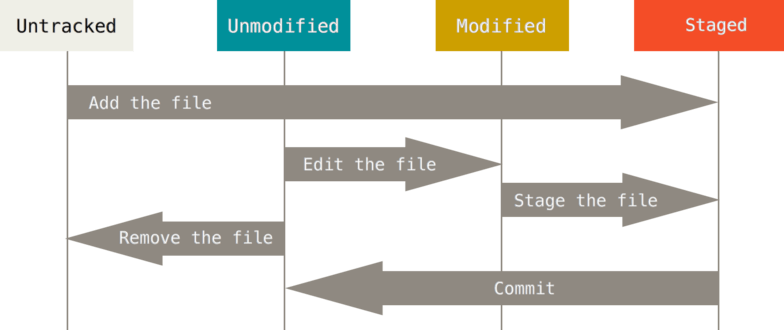
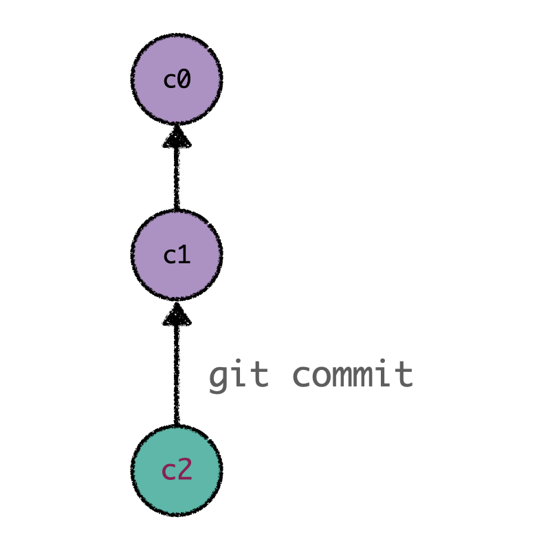
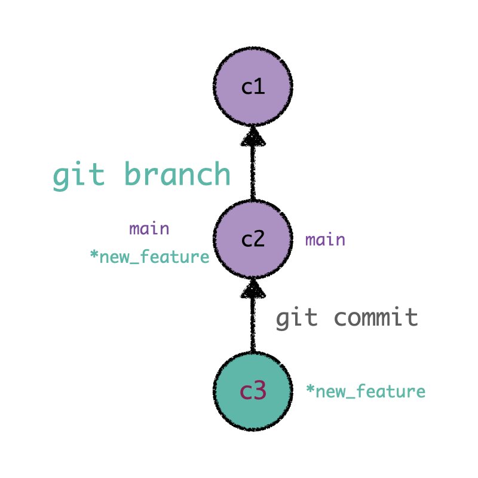
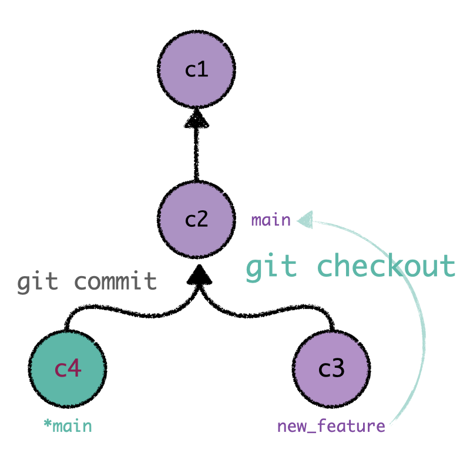
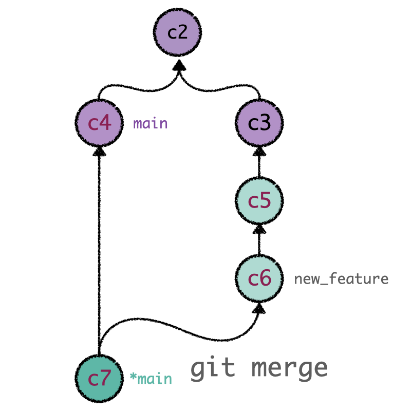
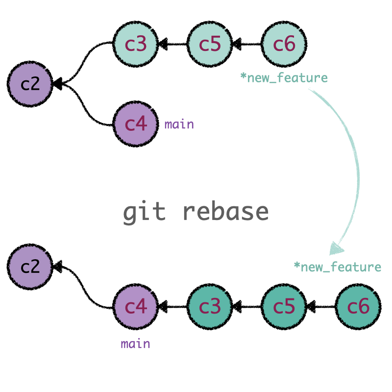

# Introduction to Git
Git is a powerful tool that permits parallel and asynchronous work while maximizing productivity 
and collaboration among team members. Despite the countless benefits Git offers, it requires time 
and dedication to learn and master. In this section, we will try to cover and define the most 
general Git concepts that may lead to misleading conclusions. Having an accurate understanding of 
these terms will notably facilitate your learning path. This section summarizes the content of 
different reviews and guides (highlighted throughout this page); we strongly encourage practicing 
the 
core Git utilities using {ref}`this lab<git_lab_branching>`, which includes a 
beginner-oriented tour about the basic concepts you are working on. 

## The three stages of Git 

:::{figure-md} pipo
:width: 500px
:align: center

Three stages of Git.
:::

Every file in a Git repository goes through three stages: __modified__, __staged__ and __committed__.
 * _Modified_ is the stage where you can add new features (or _modifications_) to the 
project. Changes are applied in the working directory (the Git tree in sync with your local 
machine), leaving unchanged the original code.
 * The second step is tracking modified files. The command `git add [files]` updates the 
Git index using the given `files` and pushes them to the _staging_ area. Files included in 
this "space" are monitored by Git, notifying when new changes are applied. This area is the 
previous step to commit your latest modifications: it stores the changes that you 
want to include in the next snapshot.   
 * The last step consists in _committing_ your modifications. `git commit` records a snapshot of 
the changes kept in the staging area while creating a new timestamp in the history. Adding the 
option `-m` allows you to pass a commit message. Git maintains a record of all the commits made, 
generating a "timeline" with committed changes ordered in time. Sitting in a particular commit, 
all previous ones are called _ancestors_, usually designated with arrows in descriptive 
illustrations.

:::{admonition} Remember
:class: important
Files in a working directory can be in two states: __tracked__, files already present in the 
previous snapshot or added to the staging area, or __untracked__, files not present 
in the last commit and therefore not staged. Git will not include untracked files in the following 
historical snapshot until you explicitly add them. Git notices new modifications added to the 
tracked files. 
:::

:::{admonition} Resources
:class: seealso 
You will discover more information and material about these concepts in the following links:
* An introductory {ref}`tutorial <saving-changes>` about the saving process in Git.
* A (maybe too comprehensive) {ref}` complete description <recording-changes>` of the recording process in Git.
* Tutorial focused on the Git command `reset`, the first part contains an enlightening {ref}`description<three-trees>` of Git's internal state management system. 
:::

## Commit, branches and heads

As previously mentioned, `git commit` is a daily command used to save the relevant changes in our repository. Git preserves a history of which commits were made and when; new commits arise from older commits (called parents or ancestors), which are used as a basis to build new commitments. 

:::{figure-md} commit
:width: 300px
:align: left

New committed changes are based off its ancestors.
:::

Most VCS's offer the possibility of creating secure "rooms" where you can play and test new 
inclusions to your model. Contrary to other VCS's (where these environments copy files from 
directory to directory), _Git branches_ are __pointers__ to commits kept in Git 
history. Branches are not new isolated copies of your project files (like a container for your 
commits), but they are references to specific commits. Developers usually represent Git branches 
as independent ramifications (or bifurcations) from the main development line. They are built 
using the `git branch` command or `git checkout -b`. 

Consider the scenario illustrated in the figure below, where you have committed a recent change. 
When 
using the command 
`git checkout -b new_feature` (or `git branch new_feature`), you are creating a new pointer 
labeled `new_feature` that refers to the last commit while maintaining the repository 
__unchanged__. That being said, a natural question may arise: what is the usefulness of creating 
a new reference? Although at first glance this operation might 
seem useless, branches reach their full potential as we generate new commits.

Moving to the branch that we created (`new_feature`), subsequent commits (for example, _c3_) will 
be referred to by 
the latter. Once we have finished our task, we return to our principal branch (`main`) by 
using the command 
`git checkout main` (remember, branches are simply references; as illustrated in the figure, `main` 
is a 
tip pointing to the commit _c2_). Sitting on `main`, we will develop a __ramification__ when 
committing a new 
change (in this case, called _c4_). Despite being conceived by the same commit _c2_, _c3_ and _c4_ 
are disconnected entities 
that "exist" in different branches. If we come back to `new_feature`, we can make 
further commits that depend neither on _c4_ nor on `main`. As mentioned at the beginning, we are 
able to write new code without affecting the main development line. 

:::{figure-md} branch1
:width: 310px
:align: left

Branches are __pointers__ to specific commits in Git history. Sitting on the commit _c2_ 
(which is referred to by 
`main`), we can create a new branch named as `new_feature`. All subsequent commits (as 
_c3_) will be 
referred to by this newly created branch. 
:::
:::{figure-md} branch2
:width: 310px
:align: right

Once we have created the new commit _c3_, we go back to the branch `main`. A new commit _c4_
will generate a bifurcation or fork in the Git history. Commits from different branches (_c3_ and 
_c4_) are disconnected.
:::
Once we are satisfied with the changes made in our code, we can integrate the multiple 
commits created in our supporting branch into the mainline by using `git merge`. This sentence 
generates a dedicated commit that combines the development of the two branches (current and 
target). Merge commits are unique as they are based on two parent commits. One should notice that 
merge commits are produced in the current branch; `git merge` updates the source branch with the 
modifications made on the target branch, leaving the latter unaffected. 

:::{figure-md} branch3
:width: 500px
:align: center

`git merge` generates a unique commit that unifies the two history lines.
:::

Closely related to the fact that branches act as a pointer is the concept of `HEAD`. `HEAD` is the 
name used to refer to the commit we are working on. It frequently points to the most recent commit. 
We can change the position of `HEAD` by using 
the command `git checkout` (actually, when you are applying this sentence for switching between 
branches, what Git is doing is migrating the tip `HEAD` from one branch to the other). We can move 
`HEAD` to a specific commit (and detached it from a branch) using the command `git checkout` plus 
the label that identifies the commit. In the same way, we are able to move the position of a branch 
by typing `git branch -f [branch_name] [position]`. 

:::{admonition} Resources
:class: seealso 
If you are interested in delving into the ideas explored in this section, you should read the 
following links:
* You will find all the information you need about Git branches on this {ref}`page<branch>`.
* Enlightening {ref}`tutorial<merge-basic>` about the `merge` command. It includes the multiple 
  options this command offers and the different merge strategies. 
:::

## Joining histories

Once you have finished your work and the new modifications satisfy your criteria, you are in 
position to integrate all these changes into the mainline of the project and share your thoughts 
with your teammates. Git offers two primary utilities to incorporate novel code from one branch 
into another, `git merge` and `git rebase`. Despite sharing a common goal, the methodology and 
philosophy behind these two are very different.

:::{admonition} Remember
:class: important
Git branches are pointers to specific commits in Git history. They are not new repositories or 
folders. 
:::

### Git Merge

The command `git merge` combines the content from two different branches into a single, unified 
commit. The process is the following: `git merge` takes two branch pointers and identifies their 
common commit ancestor. Once Git locates this point, it generates a unique "merge commit" (on 
the branch we are currently working on) that combines all committed changes from their common 
parent. This new commit is unique in the sense that it depends on two parent commits. One 
should notice that `git merge` 
only modifies the current branch; the target branch history remains unaltered (as illustrated in 
the previous figure). 

### Git Rebase

`git rebase` is the second method used to integrate changes. Rebasing compresses the content of 
the source branch into a single patch and integrates it on top of the target branch. In this way, 
we transfer the finished work from one branch to another, rewriting and flattening the history. It 
appears as if the entire sequence of commits had been created from start to finish on the same 
branch, achieving a linear project history. Internally, what Git is doing is 
replicating the commit sequence of the source branch onto the target base, creating new commits for 
each commit in the original branch. The primary motivation for using `git rebase` is to achieve a 
linear project history. 

:::{figure-md} rebase
:width: 400px
:align: center

`git rebase` captures the content from one branch and reapplies it on top of the other. In that 
way, rebasing changes the base of our branch to a different commit.
:::

:::{admonition} Good practices
:class: tip
An excellent exercise to avoid merging conflicts when pushing your content, either to the main 
branch or to a remote repository, is rebasing your changes with the most recent version of `main`. 
In this way, you guarantee that your changes are based on the most updated version of the 
repository, facilitating the merging process.
:::

Consider the following scenario: you have worked for several days on an additional feature for a 
program. Meanwhile, the mainline has been updated multiple times by your 
teammates, leaving your files obsolete. If you want to push your work to remote and open a Pull 
Request to merge your latest additions, a good practice is rebasing your content with the most 
updated version of the remote repository:

1. First, you have to download the remote main branch to include all these new modifications 
added by your colleagues: 
`git pull origin main`
2. Once you have your local main branch updated, you have to switch to your local working 
environment: 
`git checkout feature`
3. Sitting on your branch, rebase your modifications with _main_: 
`git rebase main`

_Eureka_! Now your branch is based on the remote main branch and it is ready to be pushed without any problem. 

### Git Rebase -i 
An appealing option `git rebase` offers is the interactive mode. The flag `-i` initializes the 
interactive mode, which allows you to rebase the commits individually as well as 
modifying their properties. In this way, you can determine how the sequence of 
commits is transferred to the new base. 
Besides, this mode opens the door to rewriting your Git history by using the command 
`git rebase -i HEAD~` plus the number of commits you want to rewrite. With this command, instead 
of rebasing against a distinct branch, you are "shifting" your base to the same point while 
allowing you to remodel the structure of your commits. `git rebase -i` is extensively used (and 
widely recommended) before pushing your modifications to remote; you can rectify your changes, 
reorganize your history, and keep the number of commits to a minimum.

`git rebase` not only allows you to rewrite your history, but it reinforces the concept of 
branches as pointers. Next to `git rebase` must always be a __reference__: either the label that 
refers to an 
individual commit (to rewrite your history), or a target branch to integrate your changes linearly.

:::{admonition} Resources
:class: seealso 
You will be able to find more literature about merging utilities in the following links: 
* {ref}`Tutorial<merge-basic>` about `git merge`. 
* In-depth {ref}`tutorial<rebase-basic>` about `git rebase`, including the interactive mode. 
* {ref}`Conceptual discussion<rebase-vs-merge>` about the two merging strategies.
* Immerse in the most complete {ref}`source<pro_git_book>` about Git. 
* We encourage to exercise `merge` and `rebase` tools by using the {ref}`interactive tutorials<git_lab_branching>`.  
:::

### Rewriting history
Before pushing your modifications to your shared repository, having a clean, organized history is 
strongly recommended to help the reviewing process to your comrades (and, of course, to facilitate 
your understanding of the working flow). Git offers multiple workflow customization tools that give 
you total control over the project development. We mentioned `git rebase -i`, but there are more 
options to restructure your Git commits, such as `git commit --amend`. These 
{ref}`two<rewriting_git_history>` essential {ref}`references<rewriting_git_history2>` contain 
__everything__ you should know about history-rewriting commands. These sources expose the topic in 
such a precise and straightforward manner that we are unable to include something relevant to the 
discussion.

