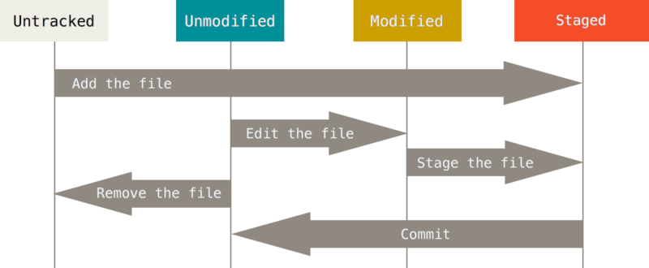

# Introduction to Git
Git is a powerful tool that permits parallel and asynchronous work while maximizing productivity and collaboration among team members. Despite the countless benefits Git offers, it requires time and dedication to learn and master. In this section, we will try to cover and define the most general Git concepts that may lead to misleading conclusions. Having an accurate understanding of these terms will facilitate immensely your learning path. This section summarizes the content of different reviews and guides presented throughout this page; we strongly encourage to practice the fundamental Git utilities using {ref}`this lab<git_lab_branching>`, which includes a beginner-oriented tour about the concepts you are working on. 

## The three stages of Git 

:::{figure-md} three_stages
:width: 400px
:align: center

:::

Every file in a Git repository goes through three stages: __modified__, __staged__ and __committed__.
 * _Modified_ is the stage where you make some additions (or _modifications_) to the project. Changes are applied in the working directory (the Git tree in sync with your local machine), leaving unchanged the original code.
 * The second step is tracking modified files. The command `git add [files]` updates the Git index using the provided `files` and pushes them to the _staging_ area. Files included in this "space" are monitored by Git, notifying when new changes are applied. This area is the prior step to commit the fresh modifications to your code; it stores the changes that you want to include in the next snapshot.   
 * The last step consists in _committing_ your modifications. `git commit` records a snapshot of the changes kept in the staging area while creating a new timestamp in the history. Adding the option `-m` allows you to pass a commit message. Git maintains a history of all the commits that were made, generating a "timeline" with commits ordered in time. Sitting in a particular commit, all previous ones are called _ancestors_, usually designated with arrows in descriptive illustrations.

:::{admonition} Remember
:class: important
Files in a working directory can be in two states: __tracked__, files that were in the previous snapshot or were added to the staging area; or __untracked__, files that were not present in the last commit and are not staged. Git will not include untracked files in the next historical snapshot until you explicitly add them. Git notices new modifications introduced in tracked files. 
:::

:::{admonition} Resources
:class: seealso 
You will discover more information and material about these concepts in the following links:
* An introductory {ref}`tutorial <saving-changes>` to saving changes in Git.
* A (maybe too comprehensive) {ref}` complete description <recording-changes>` of the recording process in Git.
* Tutorial focused on the Git command `reset`, the first part contains an enlightening {ref}`description<three-trees>` of Git's internal state management system. 
:::

## Commit, branches and heads

As previously mentioned, `git commit` is a daily command used to save the relevant changes in our repository. Git preserves a history of which commits were made and when; new commits arise from older commits (called parents or ancestors), which are used as a basis to build new commitments. 

:::{figure-md} commit
:width: 300px
:align: left

New commit is based off its ancestors
:::

Most VCS's offer the possibility of creating safe "rooms" where you can play and test new inclusions to your model. Contrary to other VCS's, Git branches are simply __pointers__ to commits saved in Git history. Branches are not new isolated copies of your project (a new container for your commits), but they are references to specific commits. Developers usually represent Git branches as independent ramifications (or bifurcations) from the main development line. They are built using the `git branch` command or `git checkout -b`. 

When using `git branch new_feature`, you are creating a new pointer labeled `new_feature` that refers to the last commit (the repository remains __unchanged__). Although at first glance this operation could seem pointless, branches reach their full potential as we generate new commits. 

Moving to the new branch, new commits will be referred now by `new_feature`. We can return to our principal branch by using the command `git checkout main` (remember, branches are simply references; `main` is a tip pointing to _c2_). We will develop a ramification when committing a new change from `main`. Despite being conceived by the same commit _c2_, _c3_ and _c4_ are disconnected entities that "exist" in different branches. Sitting on _c3_ (that is, going back to `new_feature`), we can make several new commits that depend neither on _c4_ nor on `main`. As promised, we are able to write fresh code without affecting the main development line. 

:::{figure-md} branch1
:width: 300px
:align: left

Branches are __pointers__ to specific commits in Git history. Sitting on the new branch `new_feature`, the next commits will be referred by the latter
:::

:::{figure-md} branch2
:width: 300px
:align: right

Going back to the branch `main`, a new commits will generate a bifurcation in the history. Commits from different branches are disconnected
:::

      

Once we are satisfied with the changes made in our code, we can integrate the multiple commits created in our supporting branch into the main line by using `git merge`. This sentence generates a dedicated commit that combines the development of the two branches (current and target). Merge commits are unique as they are based on two parent commits. One should notice that merge commits are produced in the current branch; `git merge` updates the current branch with the modifications made in the target branch, leaving the latter unaffected. 

:::{figure-md} branch3
:width: 300px
:align: center

`git merge` generates a new commit that unifies the two history lines 
:::

Closely related to the fact that branches act as a pointer is the concept of `HEAD`. `HEAD` is the name used to refer to the commit we are working on. It normally points to the most recent commit (which is also referred to by the current branch). We change the position of `HEAD` by using `git checkout`; when you are applying this sentence to shift from one branch to another, what you are doing is migrating the tip `HEAD` between these branches. We can move `HEAD` to a specific commit (and detached it from a branch) by using `git checkout` and the label of the commit. In the same way, we are able to move the position of a branch by typing `git branch -f [branch_name] [position]`. 

:::{admonition} Resources
:class: seealso 
If you are interested in delving into the ideas explored in this section, explore the following links:
* You will find all the information you need about Git branches on this {ref}`page<branch>`.
* Enlightening {ref}`tutorial<merge-basic>` about merge command. It includes the multiple 
  options this command offers, and the different merge strategies. 
:::
