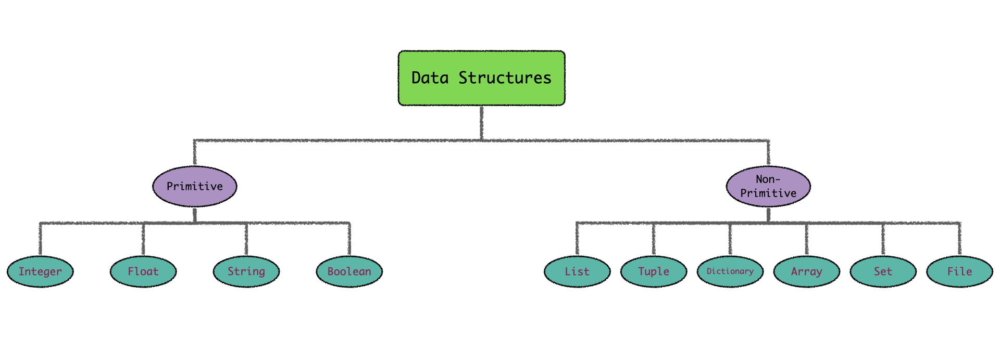

# Introduction to Python 

According to Python {ref}`webpage<python_web>`, "_Python is a programming language that lets 
you work quickly and integrate systems more effectively._ [...] _Python is powerful... and fast; 
plays well with others; runs everywhere; is friendly & easy to learn; is Open_". 
Reading these 
lines, one can get an immediate and accurate understanding of the key guidelines 
that drove the development of this language. 

To be precise, Python is a high-level, interpreted, general-purpose, and dynamic programming 
language that supports object-oriented approach. Its modularity and easiness to be 
customized to the developer's needs with external libraries have made Python the first choice 
used by many programmers, and broadly adopted in multiple environments. Python's key strengths 
are: 

1. Open source language: Python can be downloaded without any cost at its official webpage. It is developed under an open source license, {ref}`making it freely usable and distributable<python_web>`. 
2. Friendly language: Compared with other programming languages, Python is very intuitive and 
   natural. One only needs a few lines of code to write a program, thus helping the debugging 
   process. 
3. Libraries and packages: Python has a vast library of modules and functions ready to enhance 
   its capabilities. This modularity allows the application of Python in diverse fields, such 
   as Machine Learning, Mathematics and Science, or Web and Internet development. 
4. Extensible and portable: Python allows you to use libraries written in other languages. Moreover, it is platform-independent, which means that Python code can be executed on any platform (Linux, Windows, macOS).
5. Dynamical data-structure: Data-type in Python is assigned dynamically, which means that one 
   does not have to declare the data-structure of each variable in advance (as occurs in 
   _Fortran_, for instance), but it is assigned automatically while declaring the variable. For 
   example, when we set the variable `x = 5.0`, Python assigns systematically a float value 
   (`5.0`) to a float variable (`x`), avoiding wastage of memory. 
6. Object-oriented approach: Python supports an object-oriented environment (properties and behaviors are bounded into individuals objects), providing multiple functions and tools to developed applications with an object-oriented approach in mind. We will discuss this point in greater depth later.

:::{admonition} Resources
:class: seealso 
You will be able to find more about Python's core strengths at: 
* {ref}`Python webpage<python_web>`. 
* {ref}`Python Tutorial<python_tutorial>`.
* {ref}`Features of Python<python_features>`.
* Discussion on why {ref}`Python is so popular<python_medium>`.
:::

## Data-structures in Python

Python uses ___Data Structures___ as the method to handle and organize the data. They are the 
fundamental building blocks around which one develops a Python program. Data Structures allow 
the coder to store data, perform different operations and establish relationships among them. 
Python provides multiple types of data structures with unique features to organize and 
store the information efficiently according to the developer's needs. 

:::{admonition} External libraries
:class: tip
_Raw_ Python offers different data structures that can easily be enhanced by using standard and 
external libraries. In this chapter, we will focus only on the fundamental data types built into 
core Python. We will give a small glimpse of enhanced data structures at the end of this section.
:::

Data Structures are classified into two main categories: _Primitive_ structures, which represent 
the simplest blocks of data storage; and _Non-Primitive_ structures, which consist of more 
advanced elements used in more specific and complex scenarios. 

:::{figure-md} structure
:width: 700px
:align: center



__Python Data Structures__. These can be classified into two main groups: _Primitive_ Data 
Structures, core building elements in Python, and _Non-primitive_ Data Structures, collections 
of Primitive Data Structures. 
:::

### Primitive Data Structures

Primitive Data Structures represent the most elementary building elements for storing pure and 
plain data values in Python. They are defined in conjunction with a predefined set 
of operations, allowing the manipulation of the stored data. Python has four types of Primitive Data Structures: 

1. __Integer Data Structures__ are used to represent the integer numeric data. The maximum integer 
   number one is able to reach is constrained by the memory of the system.  
   
1. __Float Data Structures__ are used for designating rational numbers. Float numbers in Python 
   are represented as 64-bit (double-precision) values. The maximum value a float value can 
   have is {math}`1.8 \times 10^{308}`, while the minimum number one can represent is 
   {math}`5.8 \times 10^{-324}`. One should notice that Integer Structures are 
   _promoted_ to float numbers when operating with Float Data Structures. In this way, 
   the operation `3 + 4.0` 
   yields `7.0`; the integer number `3` is implicitly converted to the float number `3.0` to 
   operate. This type of transformation is called _Implicit Data Type Conversion_.
   
1. __String Data Structures__ are sequences of character data. Python uses String Structures to store 
   textual data information as an immutable series of characters (string variables cannot be 
   updated once they are defined). String chains are delimited by either single or 
   double-quotes. Surprisingly, string variables are iterative objects; they represent recursive 
   structures where each character is also a string object. One can find more information 
   about String Data Structures {ref}`along these lines<string>` (we strongly recommend reading the 
   section concerning _Suppressing Special Character_).
   
1. __Boolean Data Structures__ is a built-in data type that represents the true value of an 
   expression. It has only two possible values, `True (1)` and `False (0)`. Python considers 
   Boolean Data Structures as numeric elements, which means that one can apply arithmetic 
   operations to boolean variables. This fact turns very useful when counting the number of 
   `True` 
   values, for instance. Read {ref}`this page<boolean>` to get more information about Boolean 
   Data Structures.
   
:::{admonition} Data Type Conversion 
:class: tip
One can check the type of any defined variable using the built-in Python function `type()`. 
Besides, coders can modify and play with the _nature_ of the defined variables. There are two ways to 
change the type of a variable:
* __Implicit Data Type Conversion__: Python automatically converts the data type of the objects for 
  the user. This action arises when operating variables with different data types, as 
  we saw in the previous example.
* __Explicit Data Type Conversion__: Python has built-in functions that allow developers to 
  explicitly change certain variables' data types at will. Nevertheless, some defined data 
  structures might not be modified. 
:::

### Non-primitive Data Structures 

In addition to the building elements used to construct the most elementary objects, Python 
provides a series of structures that work at a higher level of complexity than the former. 
Instead of storing new definitions, these new objects store a __collection__ of Primitive Data 
Structures. Called _Non-primitive Data Structures_, they are further classified into different 
categories depending on how the primary elements are stored: 

:::{admonition} Strings
:class: tip
Strings can also be viewed as non-primitive Data Structures, since they are an _immutable 
collection 
of unicode characters_ of length 1. 
:::

1. __Arrays__ are a fundamental structure included in the Python standard library. They consist of 
   fixed-size data objects where each element is saved in adjoining memory blocks. Each memory 
   block is identified by a unique number, allowing the interpreter to efficiently locate the 
   stored objects based on this index. However, arrays can only hold data structures of the 
   same type and allow neither new entries nor modifications of existing elements (arrays are 
   immutable). These restrictions make arrays incredible efficient containers, being extremely 
   fast to find any variable contained inside a block. The `array` module should be imported 
   before using them, allowing the user to define array-type objects by applying the `array` 
   function.
   ```{code-block} python
   >>> import array as arr
   >>> new_array = arr.array("f", [3.4, 5.7, 2.1])
   >>> print(new_array)
   array('I', [2, 4, 6])
   ```
1. __Lists__ are built-in Python structures. They are implemented as _dynamic arrays_, meaning 
   that one is able to remove or introduce new elements inside a list dynamically (the list 
   object will automatically reset the memory size of the blocks). Lists can store different 
   data structures, which allows mixing arbitrary kinds of data into a single list. Lists objects 
   are defined by using square 
   brackets `[ ]`.
   ```{code-block} python
   >>> list = ["a", "b", "c"]
   >>> print(list)
   ['a', 'b', 'c']
   >>> list[1]
   'b'
   ```
1. __Tuples__, like lists, are part of Python core language. Tuples are immutable objects (tuple 
   entries cannot be modified or removed dynamically), but they can store multiple data 
   structures. One defines tuple-type objects using parenthesis `( )`. They are broadly adopted 
   in scenarios where we need to pass a data set to other users without them being able to 
   modify the original collection.
   ```{code-block} python
   >>> tuple = ("one", "two", "three")
   >>> print(tuple)
   ('one', 'two', 'three')
   >>> # tuples are immutable
   >>> arr[1] = "hello"
   Traceback (most recent call last):
      File "<stdin>", line 1, in <module>
   TypeError: 'tuple' object does not support item assignment
   ```
1. __Dictionaries__ represent a fundamental Data Structure in Python, built into its core 
   language. 
   Dictionaries are used to store an arbitrary number of primitive, __indexed__ objects, 
   meaning that each element is identified by a unique label or _key_. This indexation allows 
   developers to quickly locate the data associated with the given dictionary key. An illustrative 
   analogy 
   to understand Python's dictionaries is to compare them to a phone book, where each phone 
   number (the data) is associated with a name (the key). As far as dictionary keys are 
   concerned, not every object can be used as a valid key. 
   These must be {ref}`hashable<hash>` objects, elements that do not change during their lifetime 
   and can be compared to other objects (strings and numbers are usually adopted as dictionary 
   keys).   
   ```{code-block} python
   >>> my_dict = {
                  "alice" : 1, 
                  "bob" : 2, 
                  "charlie" : 3
                  } 
   >>> print(my_dict["alice"])
   1
   ```
1. __Sets__ represent an unordered collection of primitive, __non-repeating__ objects. The latter 
   restriction is, precisely, their principal trait: duplicate elements not allowed in 
   sets. Sets are mutable objects with dynamical insertion and deletion of entries.
   ```{code-block} python
   >>> my_set = {"alice", "bob", "charlie"} 
   >>> print(my_set)
   {'alice', 'charlie', 'bob'}
   ```   
1. __Files__ Data structures are used to store and later recover large sets of data and 
   information. Python offers multiple tools to write and read files.


:::{admonition} Resources
:class: seealso 
All the information concerning Python's Data Structures can be found here. These pages contain 
additional information explaining sophisticated structures with more advanced features than the 
basic Data Structures we have covered:  
* {ref}`Common Python Data Structures<data_struct1>`. 
* {ref}`Tutorial about Python's Data Structures<data_struct2>`.
:::

### Some remarks on _enhanced_ Data Structures

As pointed before, Python's standard library, in addition to all user-created libraries, hugely 
expand the 
regular possibilities offered by Python and the properties of its fundamental Data Structures. An 
exhaustive review of these improved Data Structures is out of the scope of this section. 
Instead, we will highlight those that we find more interesting for the user (if one is 
interested in learning more about non-standard Data Structures, this {ref}`tutorial<data_struct2>` 
covers the most common modules used to store data in Python). 

* `types.MappingProxyType` modifies regular _dictionary_ lists, making __immutable__ versions of 
the original 
dictionary's data (`MappingProxyType` module is 
a dictionary {ref}`decorator<ooa_wrapper>`). Like tuples, `MappingProxyType` objects are useful 
when defining dictionary 
views that do not allow further modifications. 
```{code-block} python
>>> from types import MappingProxyType
>>> my_dict = {
              "Alice": "spoon", 
              "Bob": "fork", 
              "Charlie": "knife"
              }
>>> view_dict = MappingProxyType(my_dict)

>>> view_dict["Charlie"] = "peeler"
Traceback (most recent call last):
  File "<stdin>", line 1, in <module>
TypeError: 'mappingproxy' object does not support item assignment
```

* `collections.namedtuple` increases the functionalities offered by regular tuples. This module 
allows you to define _field names_ for each record entry. In this way, the developer ensures that 
the correct variable or data structure enters into each of the tuple slots. `namedtuple` objects 
are implemented as Python {ref}`classes<ooa_classes>` and are immutable sequences. Information 
stored inside `namedtuple` is accessed via the field name used to identify the entry (similarly to 
Python's dictionaries). 
```{code-block} python
>>> from collections import namedtuple
>>> Family = namedtuple("Family", "mother father sister brother")
>>> my_family = Family("Marge", "Homer", "Lisa", "Bart")

>>> my_family
Family(mother='Marge', father='Homer', sister='Lisa', brother='Bart')

>>> my_family.sister 
'Lisa'
```

* `collections.Counter` is a built-in class of the Python standard library. It defines a set 
object in which multiple occurrences of the set elements are allowed. This fact turns handy when 
one is interested in counting the number of appearances of the components included in the set.
```{code-block} python
>>> from collections import Counter
>>> shopping_list = Counter()

>>> food = {"apple": 4, "bread": 2, "milk": 3}
>>> shopping_list.update(food)
>>> shopping_list
Counter({'apple': 4, 'milk': 3, 'bread': 2})

>>> more_food = {"apple": 7}
>>> shopping_list.update(more_food)
>>> shopping_list
Counter({'apple': 11, 'milk': 3, 'bread': 2})
```

* `collections.deque` is an optimized list that allows one to efficiently add and remove elements 
from both the top and the bottom of the sequence. `deque` collections are doubly-linked lists, 
which makes them excellent containers to support {ref}`LIFO<lifo>` and {ref}`FIFO<fifo>` 
semantics.  
```{code-block} python
>>> from collections import deque
>>> party_list = deque() 

>>> party_list.append("Lisa")
>>> party_list.append("George")
>>> party_list.append("Alfred")
>>> party_list.append("Miller")

>>> party_list.pop()
'Miller' 

>>> party_list.popleft()
'Lisa'
```

